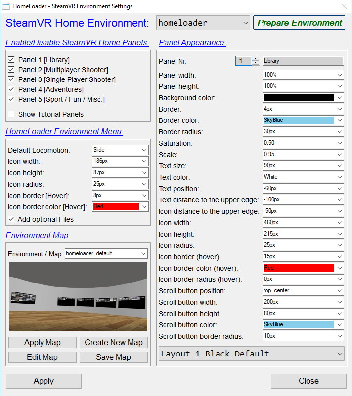
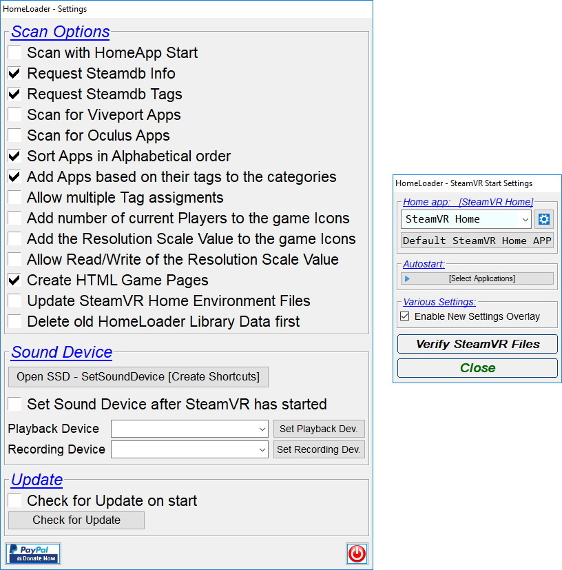
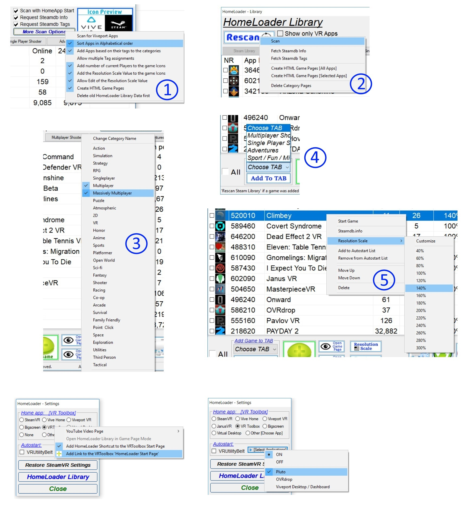

# Download:
[Download latest Version](https://github.com/CogentHub/HomeLoader/releases/)

# SteamVR Home Workshop HomeLoader Environment:
[Steam Download: SteamVR Home Environment](https://steamcommunity.com/sharedfiles/filedetails/?id=1620667283)

# Home Loader Guide:
Please read the Home Loader Guide for further explanations and information to the program.

[HomeLoaderGuide.pdf](https://github.com/CogentHub/HomeLoader/blob/master/HomeLoaderGuide.pdf)

# Preview Video / Installation / First Start:
HomeLoader 0.78 Videos: https://steamcommunity.com/workshop/filedetails/discussion/1620667283/1639793837571040443/

Older:
HomeLoader 0.63 Preview: https://youtu.be/NLHmKWOvmSA

Using VR Toolbox as Home App/Game Launcher: https://youtu.be/Tkwu8j0XDK8

Home Loader - First Start Preview: https://youtu.be/0F6zeGrc8KA

# Pictures:

 

 

 
