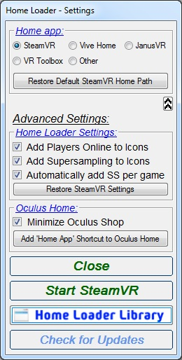
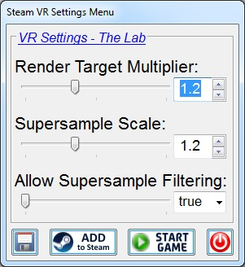
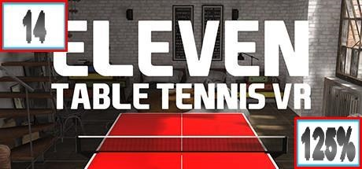
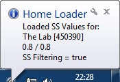

# HomeLoader
[Download latest Version](https://github.com/CogentHub/HomeLoader/releases/)

# Pictures:
Settings menu [Normal Mode]

 

Settings menu [Advanced Mode]

 

Settings menu [Steam Library and Icon Folder path]

Home Loader Library

Supersampling menu [In Home Loader Library for each game, in Normal & Advanced Mode]

Adds Players Online and Supersampling settings for each Game to the Game Icon. [In Advanced Mode]

Tray PopUp and Supersample values on the fly when loadig an new game. [In Advanced Mode]

